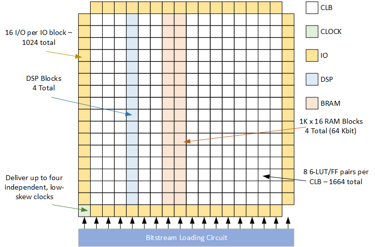
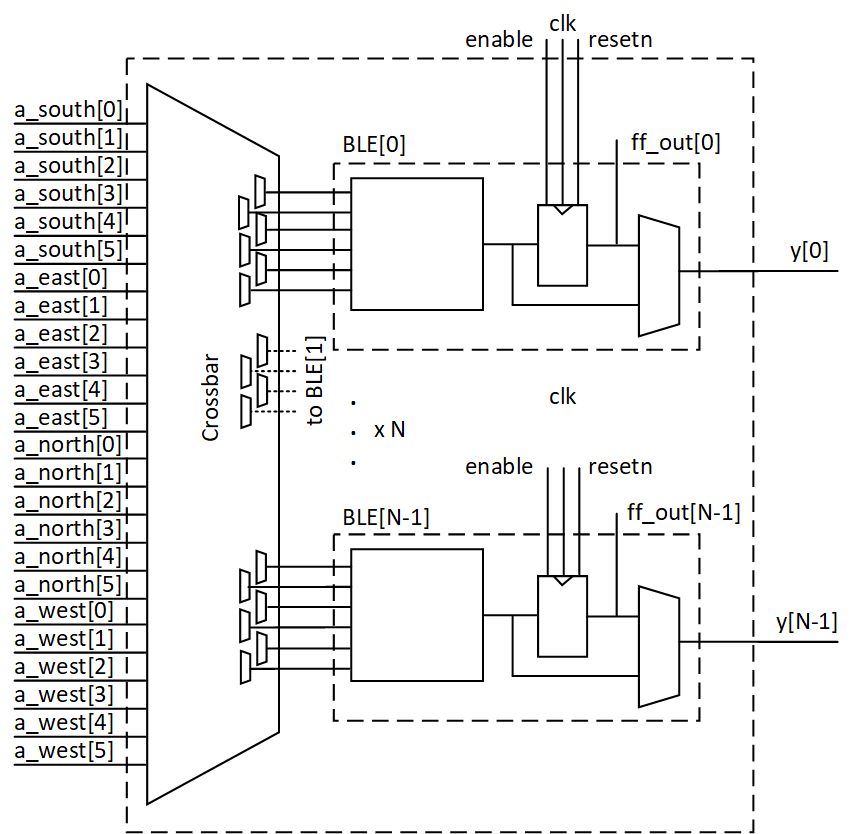
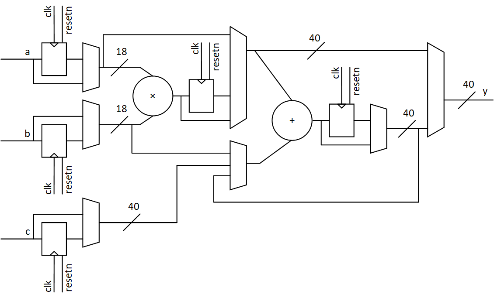

# Z1060 eFPGA

The Z1060 eFPGA is a fixed-size eFPGA architecture consisting of configurable logic blocks (CLBs), I/O blocks (IOBs), and a clock I/O block for clock distribution.

## Z1060 Architecture

A summary of Z1060 resources is shown in the table below

Resource Type        | Count
---------------------|------
Lookup Tables (LUTs) | 1664
Registers            | 1664
GPIOs                | 1024
DSPs                 | 4
BRAMs (16Kbit)       | 4
Max Clock Domains    | 4

The Z1060 architecture XML file provides a complete specification of how logic resources are arranged in this grid, the port lists of all logic resources, and how logic resources are organized and connected.  Hierarchical representations of logic blocks are provided where needed to enable correct, efficient packing and placement of a user's netlist.  The architecture XML also provides a delay model for the eFPGA and FASM feature metadata to enable logic block bitstream generation.  The Z1060 routing graph XML file encapsulates a complete model of the eFPGA interconnect architecture and contains the FASM feature metadata for interconnect bitstream generation.

The following sections summarize the architecture features of Z1060.

### Array and Grid Model

Z1060 logic resources are organized into an 18x18 array of components, depicted in the figure below.  A 16x16 array of logic blocks is surrounded on the perimeter by four banks of IOBs, one per side of the array.  One column of logic blocks is consumed by four DSP blocks.  Four block RAMs (BRAMs) consume an additonal two columns.  Corner array locations are used for programmable interconnect only with the exception of the lower left corner, where a special IOB for delivering clocks is placed.



For modeling in VPR, this array of components is arranged on a 20x20 (X,Y) grid.  The lower left corner of Z1060 (the clock IOB) is located at (1,1) on this grid.  All locations at X=0, X=19, Y=0, and Y=19 are modeled as empty.  This perimeter of empty locations is required to model the architecture in VPR correctly.

### Logic Resource Types

Brief descriptions and block diagrams for Z1060 logic resources are shown below.

#### Configurable Logic Block (CLB)

Each configurable logic block (CLB) consists of 8 6-input basic logic elements (BLEs).  A block diagram of the BLE is shown below.  The BLE contains a 6-input lookup table (LUT) a configurable flip-flop, and a multiplexer that selects whether the primary output of the BLE comes from the flip-flop or directly from the LUT.  The flip-flop output is also routed out of the BLE as a secondary output; this secondary output is connected only to local interconnect in the CLB.


The BLEs in a CLB share 24 common inputs through the CLB local interconnect, an array of multiplexers referred to as the CLB crossbar.  Each BLE input is driven by a dedicated crossbar multiplexer that selects from a subset of the CLB inputs, BLE primary outputs, and BLE secondary outputs.  The CLB inputs are subdivided between north, south, east, and west sides of the CLB to improve their interface to the eFPGA global interconnect.  The BLE primary outputs are also outputs of the CLB and route directly to eFPGA global interconnect.  The overall CLB block diagram is shown below.  The BLE output feedback paths to the crossbar are not shown in the diagram to preserve diagram clarity.



#### DSP Block

Each DSP block consists of one configurable arithmetic circuit whose operating modes are suitable for various types of digital signal processing.  DSP block modes are selected via bitstream configuration.  Users write HDL code that models their desired arithmetic operations and synthesis software infers the correct operating mode of the DSP block.

A block diagram of the DSP block is shown below.  Three data inputs, a clock, and an asynchronous reset signal are provided.  All inputs may optionally be re-registered; synthesis software infers when these registers should be used.  Two of the three inputs serve primarily as inputs to an 18x18 multiplier; however, they may also be routed to an adder circuit to use the block only for wide addition operations.  These two inputs are 18 bits wide.  A third 40-bit input is provided to enable fused multiply-add operations.  Additional operating modes enable the block to function as an accumulator or a multiply-accumulator.  For high-performance DSP, the multiply-accumulator mode may optionally be pipelined; users must model this pipelining in their HDL code to ensure correct inference.



#### BRAM

Each block BRAM (BRAM) consists of one configurable SRAM circuit.  The underlying memory primitive is a 1K x 16 bit true dual port memory macro.  Control circuitry surrounding this macro enables emulation of single port RAM and dual port RAM.  Emulation of other memory dimensions with the same number of bits is also supported; a complete table of supported memory sizes is shown below.  For memory widths wider than 8 bits, byte enables are supported to individually write specific bytes at a given address.

Word Width           | Data Width
---------------------|-----------
512                  | 32*
1024                 | 16
2048                 | 8
4096                 | 4
8192                 | 2
16384                | 1

*supported in single port mode only

BRAM modes are selected via bitstream configuration.  Users write HDL code that models their desired arithmetic operations and synthesis software infers the correct operating mode of the BRAM.  To ensure that the desired BRAM mode is selected, consult synthesis software documentation for HDL style guidelines.

A block diagram of the BRAM is shown below.  The BRAM has dedicated I/O interfaces for two complete SRAM ports.  Note that not all signals may be used in all modes.  Dedicated signals are provided for clock enable, read enable, write enable, and byte enables in addition to the signaling for clock, address, and data.   Depending on HDL coding styles chosen, users may include or exclude clock enable, read enable, and/or byte enables signals from their designs and rely on synthesis software to connect them to constant values that ensure user functionality is preserved.


#### I/O Block (IOB)

General purpose I/O blocks (IOBs) are provided to provide a consistent signal interface between signals external to the eFPGA and reconfigurable logic.  Each IOB contains eight iopad primitives.  Each iopad primitive can operate either in input mode or output mode.  The IOB thus supports a maximum of eight user I/O signals in any combination of inputs and outputs.  During RTL-to-bitstream generation, each top level RTL port directly maps to an iopad primitives via pin constraints.

The figure below shows a block diagram of the iopad primitive.  Each iopad enables a single signal to be connected .  The data direction is determined during bitstream generation and stored in a configuration bit that is directly wired to an output enable signal pad_oe that is accessible as a top level signal of the eFPGA.  When in input mode, the pad_in signal is received from external logic and passed to eFPGA logic via the inpad signal.  Similarly, in output mode the outpad signal is received from eFPGA logic and passed to pad_out.


#### Clock I/O Block (Clock IOB)

A dedicated I/O block is provided that is only used for delivering clocks to the programmable logic.  This I/O block is referred to as the clock IOB.  It is constructed from the same iopad primitive as the general purpose I/O blocks, but internally connected to the eFPGA clock network rather than to programmable interconnect.

## Z1060 Pin Constraints

Z1060 implements the signals in the table below as valid pin names for specifying pin constraints in a JSON pin constraints file (PCF).  Standard bus notatation using square brackets is required for all pins in the PCF.  For example, to constrain a user input signal `foo` to bit 17 of `gpio_in_east`, the following content should be included in the PCF file

```
  "foo": {
    "direction": "input",
    "pin": "gpio_in_east[17]"
  },
```

> **_NOTE:_** User clock signals must be mapped to the gpio_in_clk bus

Pin Name                  | Direction | MSB | LSB | Purpose
--------------------------|-----------|-----|-----|---------
gpio_in_clk               | input     | 3   | 0   | User clocks
gpio_in_south             | input     | 255 | 0   | South side GPIO inputs
gpio_in_north             | input     | 255 | 0   | North side GPIO inputs
gpio_in_west              | input     | 255 | 0   | West side GPIO inputs
gpio_in_east              | input     | 255 | 0   | East side GPIO inputs
gpio_out_south            | output    | 255 | 0   | South side GPIO outputs
gpio_oe_south             | output    | 255 | 0   | South side GPIO output enables
gpio_out_north            | output    | 255 | 0   | North side GPIO outputs
gpio_oe_north             | output    | 255 | 0   | North side GPIO output enables
gpio_out_west             | output    | 255 | 0   | West side GPIO outputs
gpio_oe_west              | output    | 255 | 0   | West side GPIO output enables
gpio_out_east             | output    | 255 | 0   | East side GPIO outputs
gpio_oe_east              | output    | 255 | 0   | East side GPIO output enables

## Z1060 Bitstream Mapping

The Z1060 bitstream format is organized into a four-dimensional array of configuration bits.  The four dimensions are the VPR grid X coordinate, VPR grid Y coordinate, word address, and bit index.  

The table below shows the minimum and maximum array values for this array.  Note that not all positions in the array contain valid configuration bits.

Index       | Min  | Max |
------------|------|-----|
X           | 0    | 19  |
Y           | 0    | 19  |
Address     | 0    | 176 |
Bit Index   | 0    | 7   |

The Z1060 bitstream map file specifies a mapping from these array indices to each FASM feature defined in the Z1060 VPR architecture file and routing graph XML file.